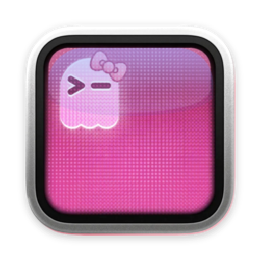

# Cute Ghostty

<p align="center">
  
</p>

<p align="center">
  <strong>The same Ghostty you love, but cuter.</strong><br>
  Pastel themes, a pink-screen kawaii icon, and an adorable launch greeting &mdash; running the real, blazing-fast Ghostty.
</p>

<p align="center">
  <a href="#install">Install</a> &bull;
  <a href="#themes">Themes</a> &bull;
  <a href="https://cute-ghostty.vercel.app">Website</a> &bull;
  <a href="https://ghostty.org">Ghostty</a>
</p>

---

## What is this?

Cute Ghostty makes [Ghostty](https://ghostty.org) cute &mdash; **pastel colour themes, a
pink-screen icon, and an optional cute launch greeting**. It is *not* a separate
terminal: you run the real, upstream Ghostty binary and Cute Ghostty just layers the
cute look on top via config. That means you always get Ghostty's GPU-accelerated
speed, native macOS UI, and every upstream fix &mdash; no fork, no stale build.

There are two ways to get it, and they're **equally supported**:

1. **Drop-in config** &mdash; install stock Ghostty, then run our installer to add the
   themes, icon, and greeting. Recommended for most people.
2. **Build-your-own `.app`** &mdash; produce a "Cute Ghostty.app" (own name + icon) from
   your current Ghostty, if you want a separate app in your dock.

## Install

### Option 1 — Drop-in config (recommended)

```bash
# 1. Install Ghostty (if you don't have it)
brew install --cask ghostty   # or grab it from https://ghostty.org

# 2. Get Cute Ghostty and install
git clone https://github.com/amywork777/CuteGhostty.git
cd CuteGhostty
./install.sh
```

`./install.sh` adds an `include` line to your `~/.config/ghostty/config` (it backs
up anything it touches). Prefer to make it your whole config? Use `./install.sh
--replace`. To remove everything: `./install.sh --uninstall`.

Restart Ghostty and you're cute. Because this *is* your Ghostty config, opening
**Settings (⌘ ,)** opens the cute config &mdash; edit colours and the icon right there.

### Option 2 — Build your own Cute Ghostty.app

```bash
git clone https://github.com/amywork777/CuteGhostty.git
cd CuteGhostty

# Point it at your CURRENT Ghostty so you get the latest upstream binary
./build.sh /Applications/Ghostty.app
cp -R "Cute Ghostty.app" /Applications/

# Then add the themes / icon config / greeting
./install.sh
```

The `.app` is a name + icon reskin of *your* Ghostty &mdash; it keeps the stock bundle
identifier and reads the same `~/.config/ghostty/config`, so the cute config applies
to it too.

> **Note:** keep only one of stock Ghostty / Cute Ghostty.app installed at a time &mdash;
> they share the `com.mitchellh.ghostty` bundle identifier (this is deliberate; it's
> what avoids the old memory-leak and wrong-config problems).

**Requirements:** macOS 13.0+ &bull; Apple Silicon + Intel (whatever your Ghostty supports)

## Themes

A family of pastel themes, each keyed on a background hue. Pick one in your config:

```
# auto-switch with the system appearance:
theme = "light:Cute Pink,dark:Cute Pastel Dreams"

# or just one:
theme = "Cute Mint"
```

| Light | Dark |
|-------|------|
| Cute Pink · Cute Lavender · Cute Mint · Cute Peach · Cute Lemon · Cute Sky | Cute Pastel Dreams · Cute Midnight Pink · Cute Midnight Lavender · Cute Midnight Mint |

They install into `~/.config/ghostty/themes/` and use Ghostty's standard theme
format, so they show up in Ghostty's theme list too.

## The cute icon

Set entirely via Ghostty config (no patched binary) &mdash; it keeps Ghostty's own ghost
and aluminum frame, tinting only the screen pink:

```
macos-icon = custom-style
macos-icon-frame = aluminum
macos-icon-screen-color = #FF6FA3
```

## Cute launch greeting (optional)

A pink ghost + a random cute message on each new shell. Opt in by adding one line to
your `~/.zshrc` (the installer offers this):

```bash
source /path/to/CuteGhostty/cute-greeting.sh
```

## Repo structure

```
cute-ghostty.config   # the cute config (icon + theme selection + touches)
themes/               # Cute Pink, Cute Pastel Dreams, … (Ghostty theme format)
install.sh            # safe installer / --replace / --uninstall
cute-greeting.sh      # opt-in launch greeting (ghost + cute messages)
build.sh              # optional: build Cute Ghostty.app from your current Ghostty
assets/               # icon, dmg background, Info.plist (name only)
site/                 # the website
```

## Contributing

Contributions welcome! Ideas:

- **New themes** &mdash; add a `themes/Cute <Name>` file (pastel, cottagecore, etc.)
- **Icon variants** &mdash; alternative `macos-icon-*` recipes
- **Greeting messages** &mdash; more cute lines for `cute-greeting.sh`

## Credits

- [Ghostty](https://ghostty.org) by Mitchell Hashimoto
- [Ghostty Source](https://github.com/ghostty-org/ghostty) &mdash; MIT Licensed

## License

Based on [Ghostty](https://github.com/ghostty-org/ghostty), licensed under the
[MIT License](https://github.com/ghostty-org/ghostty/blob/main/LICENSE).
